# Jarkom_Modul2_Lapres_E1

## Inisialisasi UML
### Awal konfigurasi

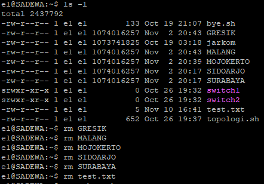

edit bye.sh

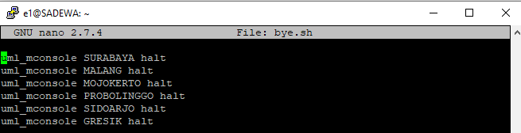 

edit topologi.sh

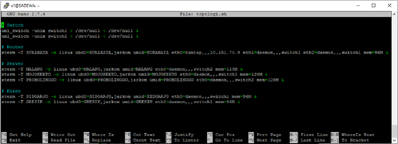

### Selesai konfigurasi

bash topologi.sh

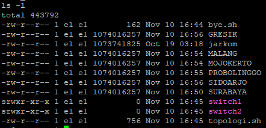

nano /etc/sysctl.conf

Hilangkan tanda pagar (#) pada bagian net.ipv4.ip_forward=1

sysctl -p

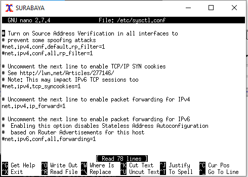

nano /etc/network/interfaces

service networking restart

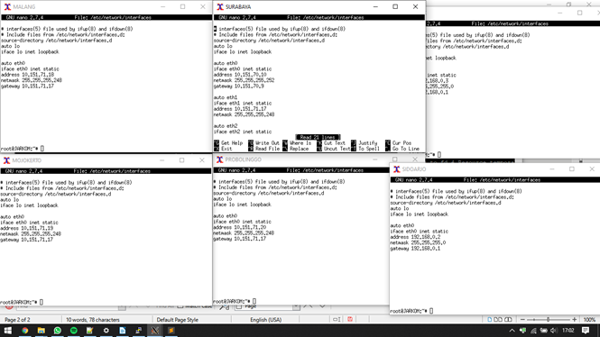

prepare iptables.sh

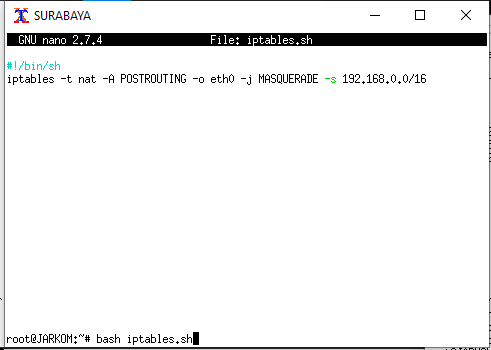

check iptables configuration is successful

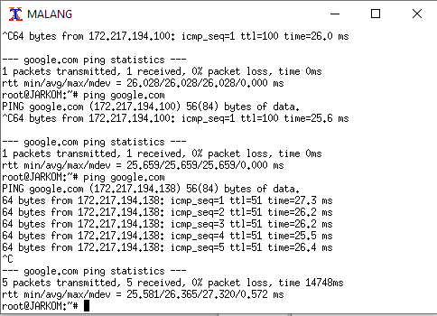

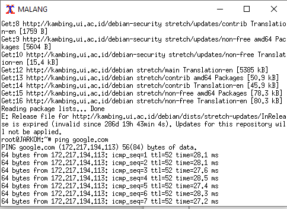

prepare source proxy.sh untuk apt-get

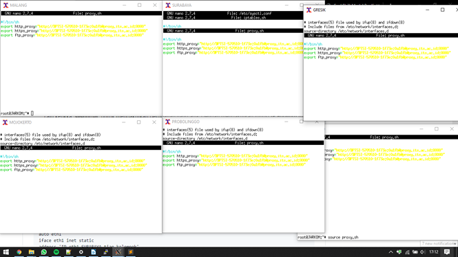

do apt-get update

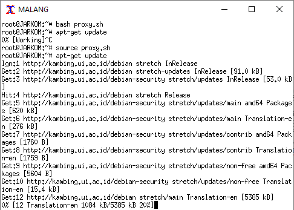

install on servers: 

apt-get install bind9 -y

apt-get install apache2 -y

apt-get install php -y

install on clients

apt-get install dnsutils -y

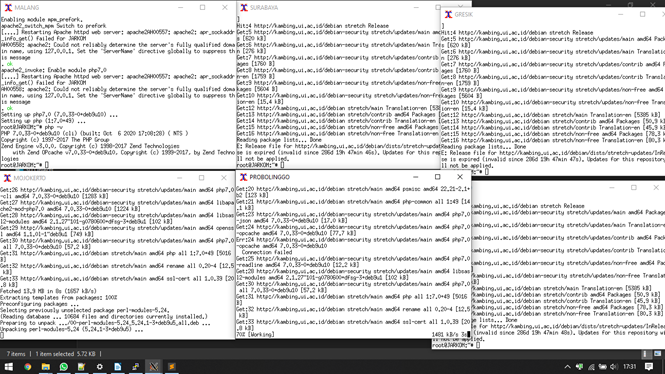

## Setup DNS
### Untuk mengerjakan poin-poin berikut
-	Server MALANG akan digunakan sebagai DNS Server Master, MOJOKERTO akan digunakan sebagai DNS Server Slave 
-	(1) alamat http://semerue01.pw yang
-	(2) alias http://www.semerue01.pw ke http://semerue01.pw yang
-	(3) subdomain http://penanjakan.semerue01.pw diatur DNS-nya pada MALANG mengarah ke IP Server PROBOLINGGO
-	(4) reverse domain untuk domain utama.
-	(5) DNS Server Slave pada MOJOKERTO
-	(6) subdomain dengan alamat http://gunung.semerue01.pw yang didelegasikan pada server MOJOKERTO dan mengarah ke IP Server PROBOLINGGO.

### MALANG
Nano named.conf.local

    # file content named.conf.local
    zone "semerue01.pw" {
    type master;
    notify yes;
	  also-notify { 10.151.71.19; }; // Masukan IP MOJOKERTO tanpa tanda petik
	  allow-transfer { 10.151.71.19; }; // Masukan IP MOJOKERTO tanpa tanda petik
	  file "/etc/bind/jarkom/semerue01.pw";
    };

    // reverse dns
    zone "71.151.10.in-addr.arpa" {
	  type master;
	  file "/etc/bind/jarkom/71.151.10.in-addr.arpa";
    };
    #
    
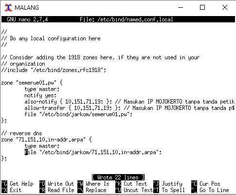

mkdir /etc/bind/jarkom

cp /etc/bind/db.local /etc/bind/jarkom/semerue01.pw

nano /etc/bind/jarkom/semerue01.pw

    # file content /etc/bind/jarkom/semerue01.pw
    @	IN	NS	semerue01.pw.
    @	IN	A	10.151.71.20	;IP PROBOLINGGO
    www	IN	CNAME	semerue01.pw.	;alias
    penanjakan	IN	A	10.151.71.20	;subdomain

    ns1	IN	A	10.151.71.19	;delegasi gunung IP MOJOKERTO
    gunung	IN	NS	ns1
    #
    
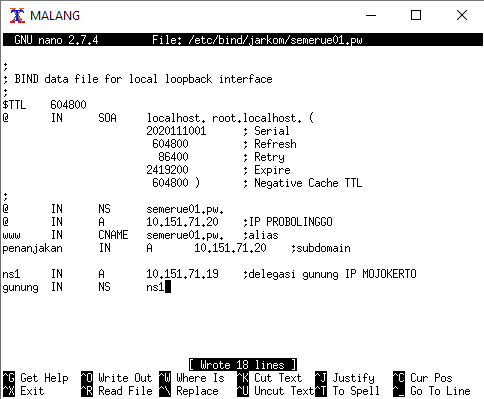

cp /etc/bind/db.local /etc/bind/jarkom/71.151.10.in-addr.arpa

nano /etc/bind/jarkom/71.151.10.in-addr.arpa

    # file content /etc/bind/jarkom/71.151.10.in-addr.arpa
    71.151.10.in-addr.arpa. IN	NS	semerue01.pw.
    20			IN	PTR	semerue01.pw. ;BYTE KE-4 IP PROBOLINGO
    #

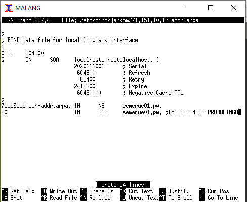

### MOJOKERTO
nano /etc/bind/named.conf.local

    # file content named.conf.local
    // subdomain delegasi ke mojokerto
    zone "gunung.semerue01.pw" {
	  type master;
	  notify yes;
	  also-notify { 10.151.71.19; }; // Masukan IP MOJOKERTO tanpa tanda petik
	  allow-transfer { 10.151.71.19; }; // Masukan IP MOJOKERTO tanpa tanda petik
	  file "/etc/bind/jarkom/gunung.semerue01.pw";
    };

    // slave record
    zone "semerue01.pw" {
	type slave;
	masters { 10.151.71.18; }; // Masukan IP MALANG tanpa tanda petik
	file "/var/lib/bind/semerue01.pw";
    }
    #

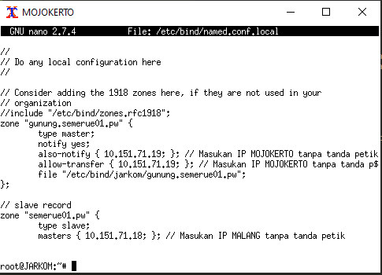

mkdir /etc/bind/jarkom

cp /etc/bind/db.local /etc/bind/jarkom/gunung.semerue01.pw

nano /etc/bind/jarkom/gunung.semerue01.pw

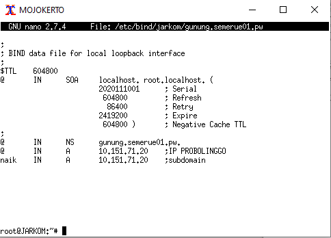

ingat suntuk ervice bind9 restart

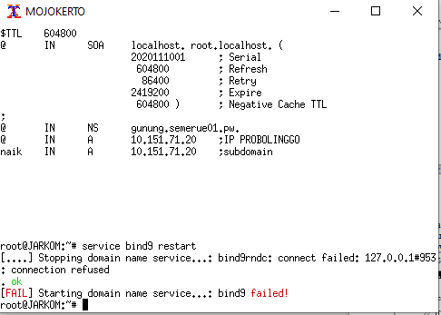

error 

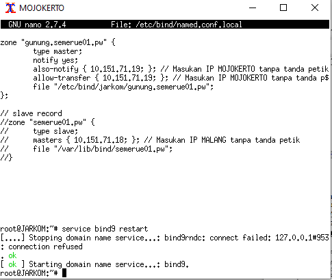

karena saat slave server di comment, bind9 berjalan dengan normal, terdapat masalah dengan slave zone file. Sepertinya server tidak bisa kontak dengan master dns server. Ternyata lupa options file Malang dan Mojokerto 

nano /etc/bind/named.conf.options 

comment dnssec-validation dan tambah allow-query{any;};

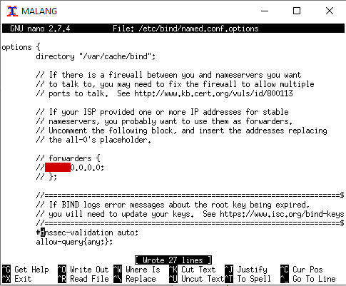

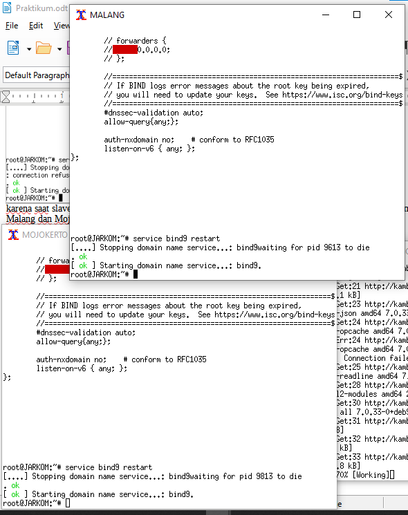

Verifikasi sudah berhasil atau belum

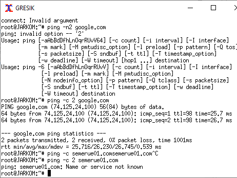

ingat ganti resolv.conf

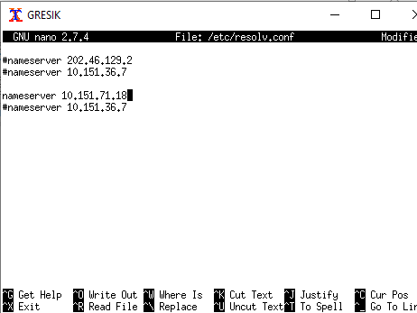

ping -c 2 semerue01.pw

ping -c 2 www.semerue01.pw

ping -c 2 penanjakan.semerue01.pw

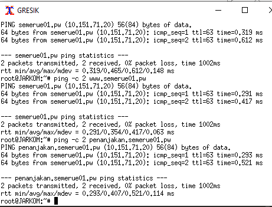

testing reverse dns record, karena gresik kurang memory, bukti cukup lihat ping diatas, semua ping nya resolve ke semerue01.pw. Maka reverse dns record jalan

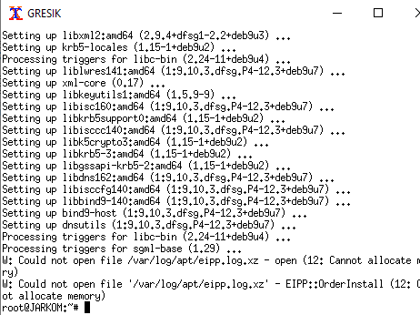

test master slave

nano /etc/resolve.conf

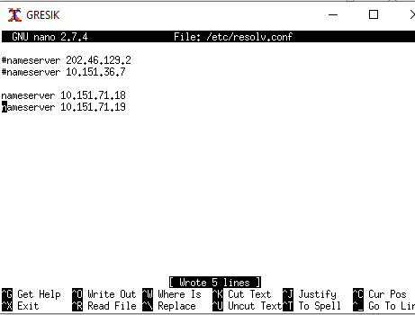

malang – service bind9 stop

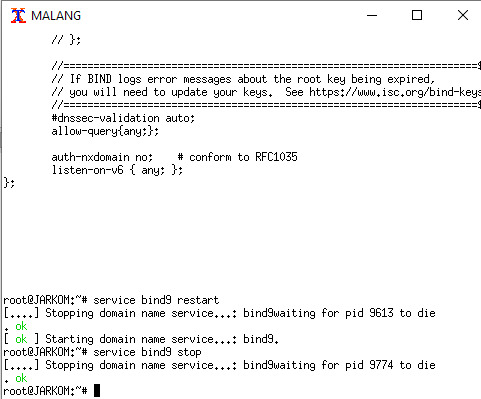

ping -c 2 semerue01.pw

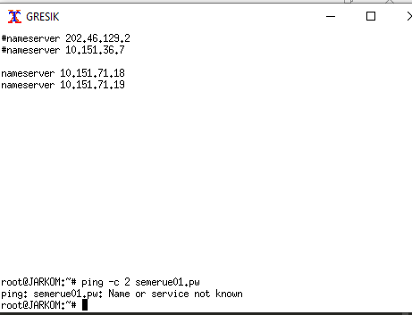

error, ternyata tadi named.conf.local di MOJOKERTO lupa di uncomment

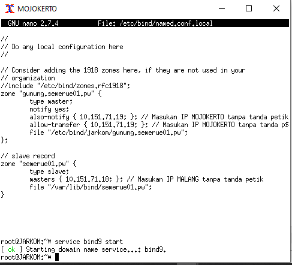

Ternyata lupa titik koma

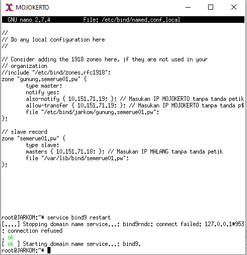

ping -c 2 semerue01.pw

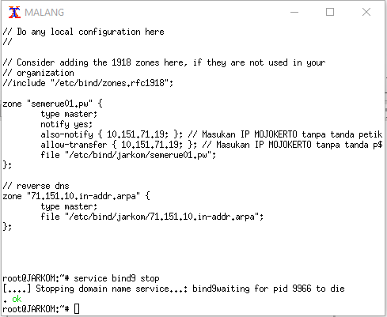

ingat untuk malang – service bind9 start

ping -c 2 naik.gunung.semerue01.pw

ping -c 2 gunung.semerue01.pw

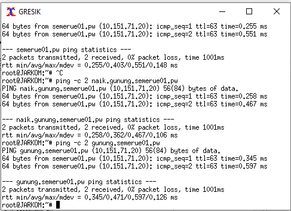

    > berhasil.gif

Sebelum ke apache, kelompok e01 ada reset ulang karena kena memory leak, diduga karena instalasi apt-get install terlalu liberal, sekarang package yang di install se minimal mungkin 

## Apache
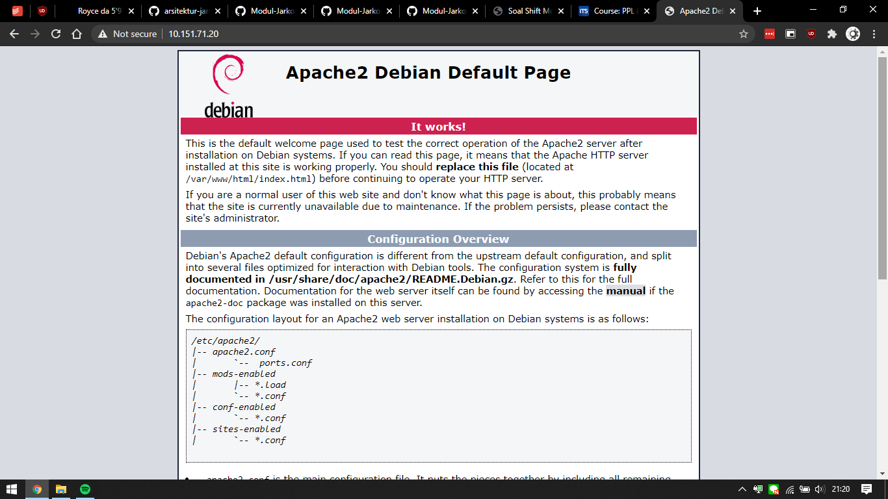

download file dari soal

mkdir /var/www/semerue01.pw

cd /var/www/semerue01.pw

wget 10.151.36.202/semeru.pw.zip

mkdir /var/www/penanjakan.semerue01.pw

cd /var/www/penanjakan.semerue01.pw

wget 10.151.36.202/penanjakan.semeru.pw.zip

mkdir /var/www/naik.gunung.semerue01.pw

cd /var/www/naik.gunung.semerue01.pw

wget 10.151.36.202/naik.gunung.semeru.pw.zip

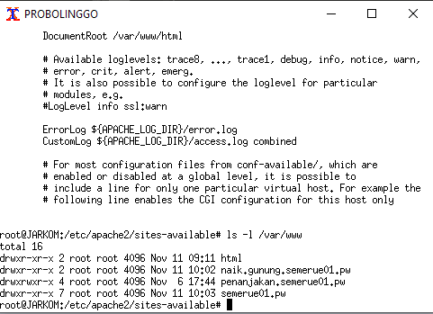

### Nomor 8

setup semerue01.pw.conf

nano /etc/apache2/sites-available/semerue01.pw.conf

    # file content
    <VirtualHost *:80>
	  ServerAdmin webmaster@localhost

	  ServerName semerue01.pw
	  ServerAlias www.semerue01.pw
	  DocumentRoot /var/www/semerue01.pw

	# untuk allow .htaccess rewrite
	<Directory /var/www/semerue01.pw>
		Options +FollowSymLinks -Multiviews
		AllowOverride All
	  </Directory>
    </VirtualHost>
    #

nyalakan rewrite dari apache supaya bisa .htaccess

a2enmod rewrite

service apache2 reload

nano /var/www/semerue01.pw/.htaccess

Coba untuk gunakan .htaccess

    # file content .htaccess
    RewriteEngine On
    RewriteCond %{REQUEST_FILENAME} !-d
    RewriteRule ^(.*?)/home$ $1/index.php/home [NC,L]
    # RewriteRule ^([^\.]+)$ $1.php [NC,L]
 
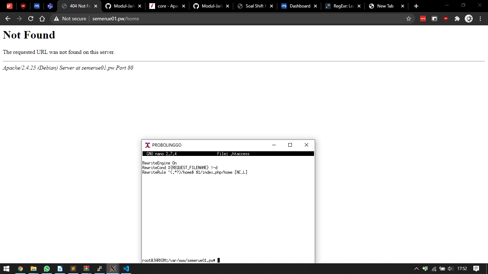

Tidak bisa

step 2, googling, didapatkan file .htaccess

### Nomor 9
    # file content .htaccess
    RewriteEngine On
    RewriteCond %{REQUEST_FILENAME} !-f
    RewriteCond %{REQUEST_FILENAME} !-d
    RewriteRule (.*) /index.php/$1 [L]
    #

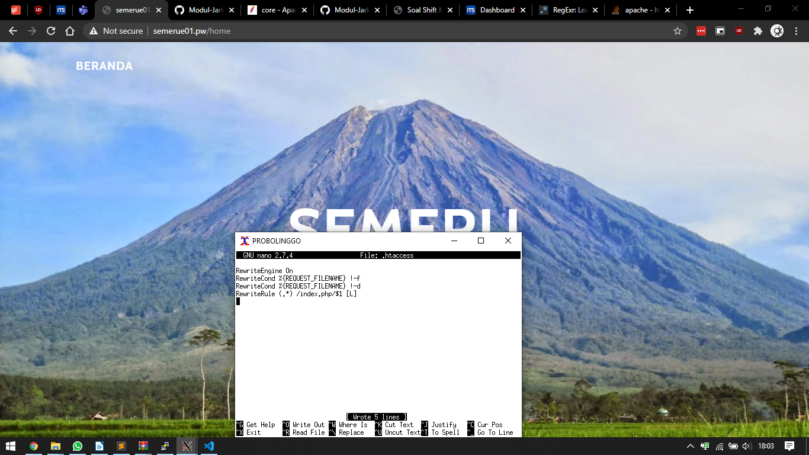

    > berhasil.gif

konfigurasi.penanjakan.semerue01.pw.conf nomor 10 11 12 13

cp 000-default.conf penanjakan.semerue01.pw.conf

nano /etc/apache2/sites-available/penanjakan.semerue01.pw.conf

    # file content penanjakan.semerue01.pw.conf
    <VirtualHost *:80>
	  ServerAdmin webmaster@localhost

	  ServerName penanjakan.semerue01.pw
	  # nomor 10
	  DocumentRoot /var/www/penanjakan.semerue01.pw

	  # nomor 11
	  # allow public folder directory listing
	  <Directory /var/www/penanjakan.semerue01.pw/public>
		Options +Indexes
	  </Directory>
	  # disable subfolder in public to directory listing
	  <Directory /var/www/penanjakan.semerue01.pw/public/*>
		Options -Indexes
	  </Directory>

	  # nomor 12 override error 404
	  ErrorDocument 404 /errors/404.html

	  # nomor 13 redirect dari website.com/public/javascripts
	  # ke website.com/js
	  Alias "/js" "/var/www/penanjakan.semerue01.pw/public/javascripts"
    </VirtualHost>
    #

a2ensite penanjakan.semerue01.pw

service apache2 reload

### nomor 10
Bisa diakses

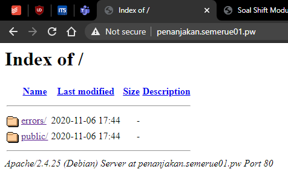
### nomor 11
Public bisa diakses, namun subfolder tidak.

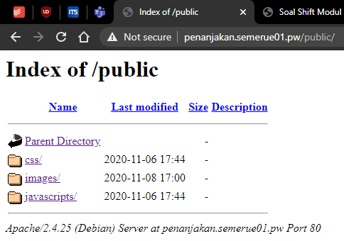

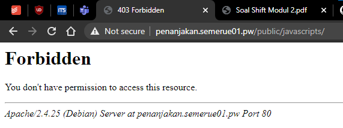
### nomor 12
custom error message

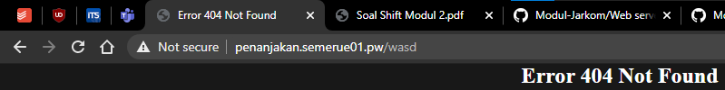
### nomor 13
sementara, rule nomor 11 dicomment untuk testing apakah redirect sudah berhasil,

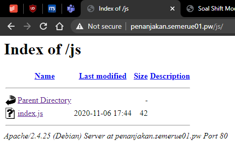

Jangan lupa uncomment rule nomor 11

### nomor 14, 15
untuk port baru

nano /etc/apache2/ports.conf

tambahkan Listen 8888

cp 000-default.conf naik.gunung.semerue01.pw.conf

nano /etc/apache2/sites-available/naik.gunung.semerue01.pw.conf

    # file content
    <VirtualHost *:8888>
	  ServerAdmin webmaster@localhost

	  ServerName naik.gunung.semerue01.pw
	  DocumentRoot /var/www/naik.gunung.semerue01.pw

	  <Directory /var/www/naik.gunung.semerue01.pw>
		# nomor 15
		AuthType Basic
		AuthName "Restricted Content"
		AuthUserFile /etc/apache2/.htpasswd
		Require valid-user
	  </Directory>
    </VirtualHost>
    #

a2ensite naik.gunung.semerue01.pw

service apache2 reload

htpasswd -c /etc/apache2/.htpasswd semeru

passwordnya pake kuynaikgunung
### nomor 14
 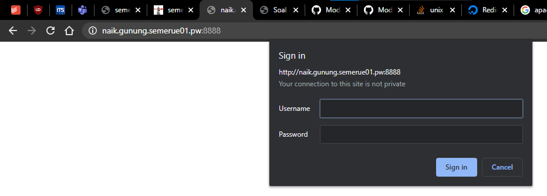
### nomor 15
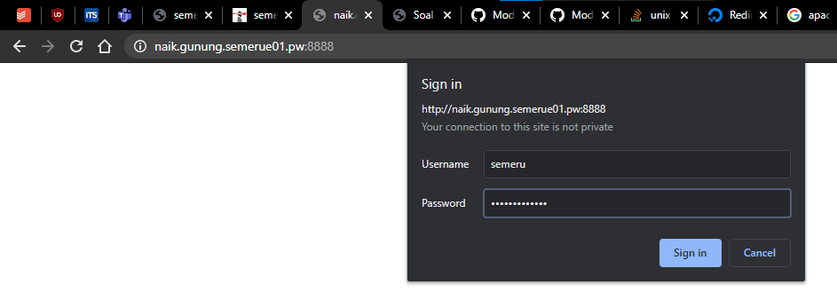
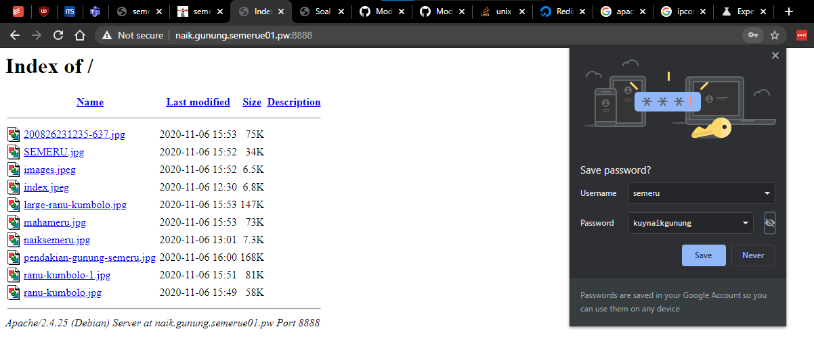
 
### nomor 16
nano /etc/apache2/sites-available/000-default.conf
    
    # file content 000-default.conf
    <VirtualHost *.80>
	  ServerAdmin webmaster@localhost

	  DocumentRoot /var/www/semerue01.pw
	  # untuk allow .htaccess rewrite
	  <Directory /var/www/semerue01.pw>
		Options +FollowSymLinks -Multiviews
		AllowOverride All
	  </Directory>
    </VirtualHost>
    #

service apache2 reload

tambah rewrite rule file /var/www/semerue01.pw dengan hasil google

RewriteBase /

RewriteCond %{HTTP_HOST} ^10\.151\.71\.20$

RewriteRule ^(.*)$ http://www.domainname.com/$1 [L,R=301]

nano /var/www/semerue01.pw/.htaccess

    # hasil file ile content .htaccess
    RewriteEngine On
    RewriteCond %{REQUEST_FILENAME} !-f
    RewriteCond %{REQUEST_FILENAME} !-d
    RewriteRule (.*) /index.php/$1 [L]
    RewriteBase /
    RewriteCond %{HTTP_HOST} ^10\.151\.71\.20$
    RewriteRule ^(.*)$ http://www.domainname.com/$1 [L,R=301]
    #

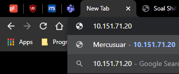 

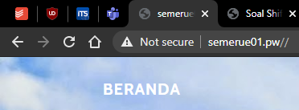
### Nomor 17
Disable rule hiding public subfolder dulu
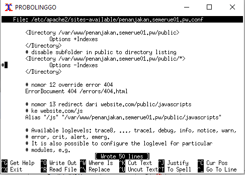

jangan lupa dinyalakan lagi rule hiding public subfolder 

tambah konfigurasi di penanjakan.semerue01.pw.conf

nano /etc/apache2/sites-available/penanjakan.semerue01.pw.conf
	
    # nomor 17 redirect semeru
	  <Directory /var/www/penanjakan.semerue01.pw/public/images>
		Options +FollowSymLinks -Multiviews
		AllowOverride All
	  </Directory>

nano /var/www/penanjakan.semerue01.pw/public/images/.htaccess

    # file content .htaccess
    RewriteEngine On
    RewriteCond %{REQUEST_URI} semeru
    RewriteRule .* semeru.jpg
    #

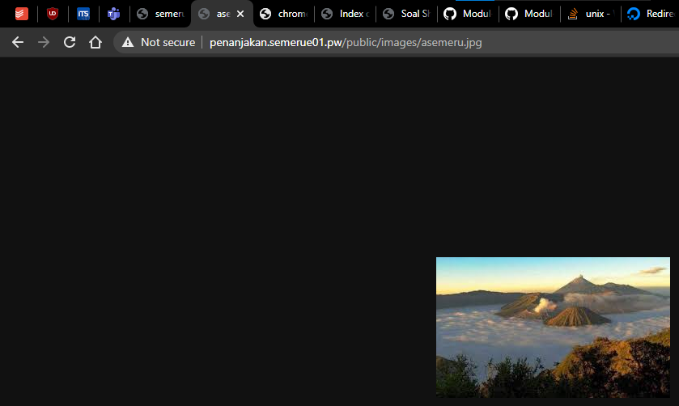

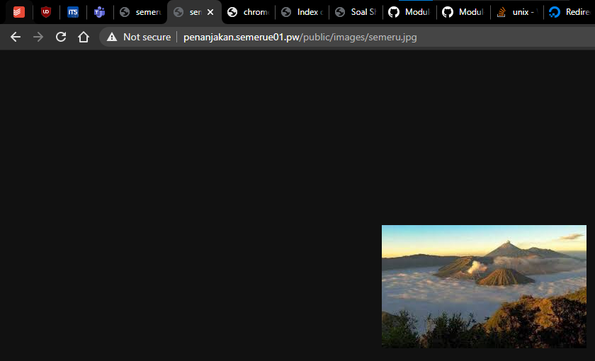
 
 

